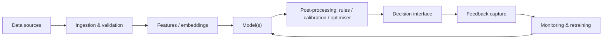

# AI System Blueprint — <project>

_The AI Maker · <date> · status: proposal_

## 1. Executive summary
- **Problem**: one sentence.
- **Recommended system**: one sentence (e.g. "A hybrid physics-residual GBDT anomaly detector on edge gateways, with a digital-twin what-if planner for maintenance scheduling").
- **Why this, not alternatives**: decision score X vs Y, win probability Z %, key reasons.
- **Expected outcome**: objective metric from baseline → target, by when.
- **Biggest risk & mitigation**:
- **First experiment (2 weeks)**:

## 2. Problem, objectives & constraints
Summary of PROBLEM_BRIEF: decision supported, cost of errors, objectives table (metric / baseline / target), guardrails, constraints. → [PROBLEM_BRIEF.md](PROBLEM_BRIEF.md)

## 3. State of the art & reuse
Key findings, reusable models/datasets/tools with licenses, build-vs-buy conclusions. → [SOTA_REVIEW.md](SOTA_REVIEW.md)

## 4. Approaches considered
| Candidate | Summary | Score | Win prob. | Why selected / rejected |
|---|---|---|---|---|
→ [ARCHITECTURE_OPTIONS.md](ARCHITECTURE_OPTIONS.md), [DECISION.md](DECISION.md)

## 5. Selected architecture

Components table: name · responsibility · technology · why chosen (ADR link) · owner.

## 6. Data pipeline & strategy
Sources, quality actions, labeling, splits, synthetic data (if any, with validation), privacy/governance, feature pipeline, versioning. → [DATA_STRATEGY.md](DATA_STRATEGY.md)

## 7. Model strategy & training
Baseline(s), main model(s), pretrained vs fine-tuned vs trained, training procedure, hyperparameter search, uncertainty handling, compute estimate (from the estimator, with assumptions).

## 8. Simulation / digital twin / synthetic environments
Decision (used or not) and why; design, calibration and validation. → [SIMULATION_PLAN.md](SIMULATION_PLAN.md)

## 9. Evaluation & validation
Metric hierarchy, validation ladder with exit criteria, statistical plan, monitoring. → [EVALUATION_PLAN.md](EVALUATION_PLAN.md)

## 10. Deployment & operations
Serving pattern (batch/online/streaming/edge/hybrid), infrastructure, latency & cost per prediction, MLOps/LLMOps, rollout (shadow → canary → full), rollback & fallbacks.

## 11. Security, reliability & responsible AI
AI-specific threats and mitigations, reliability patterns, fairness/explainability/human oversight, regulatory classification and obligations.

## 12. Costs
| Item | Estimate | Assumptions/source |
|---|---|---|
| Data acquisition & labeling | | |
| Training / fine-tuning | | |
| Inference (per month at expected volume) | | |
| Infrastructure & tooling | | |
| People | | |

## 13. Roadmap
| Phase | Duration | Deliverables | Exit criteria |
|---|---|---|---|
| 0. Discovery & data audit | | | |
| 1. Baseline & evaluation harness | | | baseline measured on locked test set |
| 2. Candidate bake-off / prototype | | | selected approach beats baseline by target margin |
| 3. Pilot (shadow → limited live) | | | live metrics within tolerance; guardrails hold |
| 4. Production | | | SLOs, monitoring, runbooks in place |
| 5. Continuous improvement | ongoing | | |

## 14. Risks
| Risk | Likelihood | Impact | Mitigation | Owner |
|---|---|---|---|---|

## 15. Future improvements
Research bets and upgrades worth revisiting (with trigger conditions).

## 16. Assumptions & sources
All assumptions with verification plans; all sources with links and dates.
